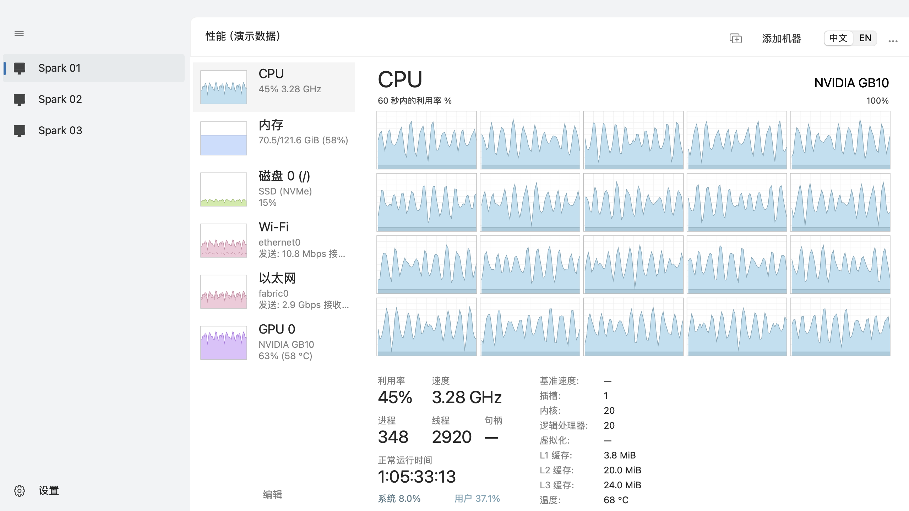
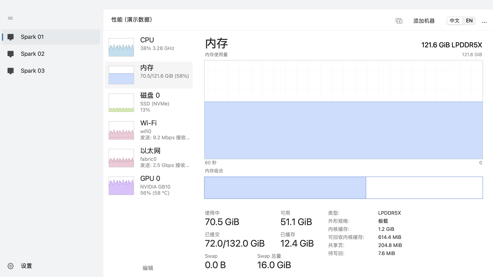
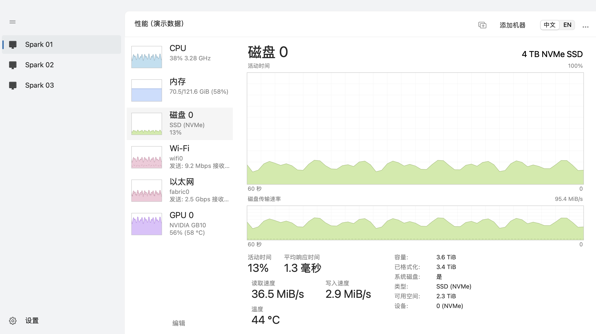
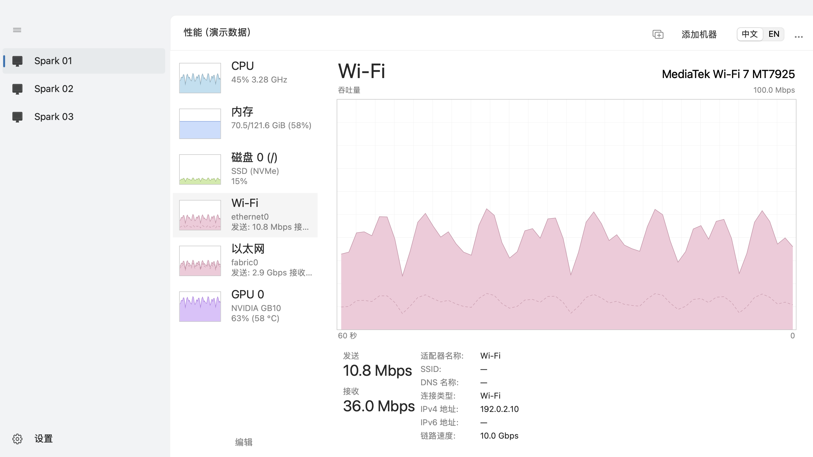
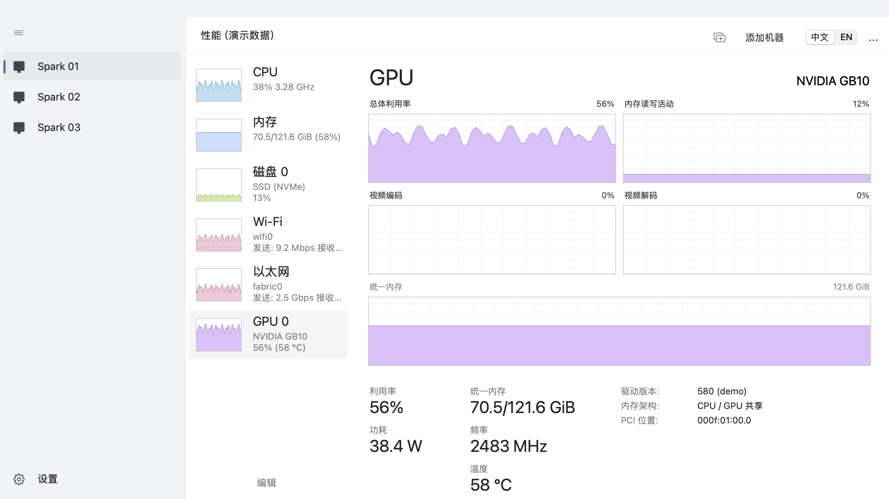
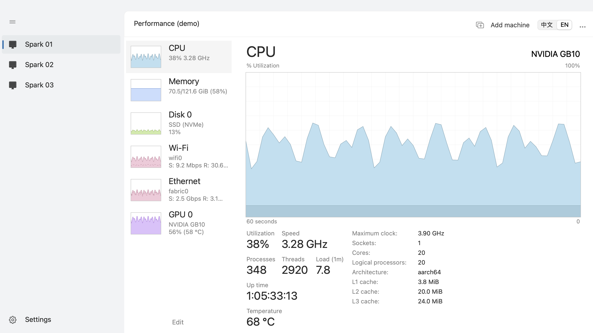
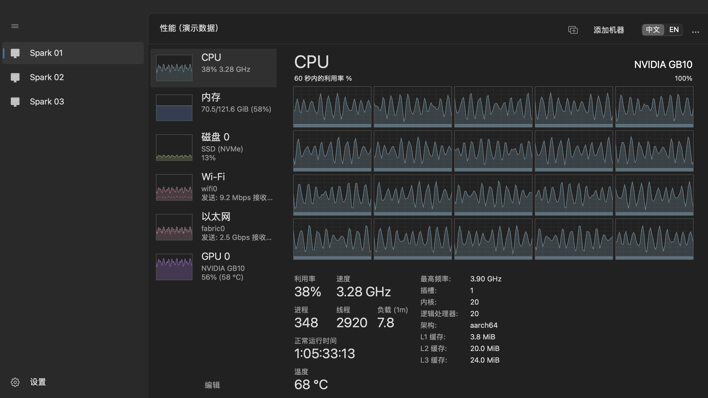
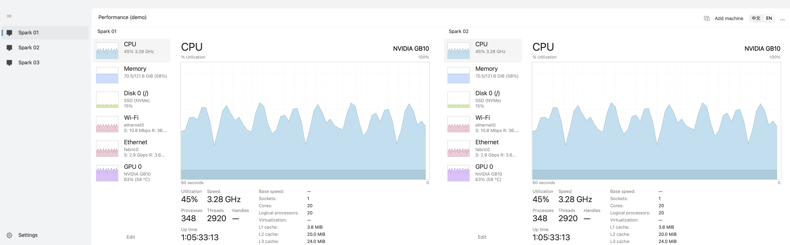

# Spark Manager / DGX Spark管理器

A native Swift/AppKit macOS performance monitor for NVIDIA DGX Spark and Windows PCs, with a Windows 11 Task Manager-inspired performance interface. No WebView, HTTP service, remote installation, or administrator access is required.

**macOS 14+, Apple Silicon.** MIT licensed. Independent community software; not an NVIDIA, Microsoft, or Apple product.

[Download the macOS preview / 下载 macOS 测试版](https://github.com/Sapphire-Rapids/Spark-Manager/releases)

## 中文

### 使用

将 `Spark Manager.app` 拖入 `/Applications`，双击运行。点击“添加机器”，输入 SSH 地址、端口、用户名，选择远端系统（DGX Spark 或 Windows），再选择密码或 OpenSSH Ed25519 / RSA 私钥。支持上述私钥的口令加密；不支持硬件安全密钥、完整 SSH config 解析或跳板机配置。首版不改变远端 SSH 设置。

第一次连接会显示主机指纹，请与可信来源核对。主机指纹改变时不会自动接受，可在核实后通过连接设置重新确认。密码和私钥口令保存在 macOS Keychain，私钥本身仍留在原文件中。

- CPU 图右键切换总体利用率和逻辑处理器。Spark 的 20 核使用 5×4 网格；Windows 根据实际逻辑处理器数量排布，32 线程使用 8×4 网格。
- CPU 的浅色区域为用户态，深色区域为系统态；两者合计为总利用率。
- 右上角切换中文／EN；“…”菜单切换浅色／深色／系统主题。
- 点击硬件列表底部“编辑”，直接在列表勾选显示／隐藏，拖动调整顺序。未勾选设备变淡排在下方；点击“完成”退出编辑。
- 机器切换位于左侧 Windows 风格导航栏。点击机器替换当前列；汉堡按钮可收起导航。右侧每容纳约 860pt 就增加一列，所有已连接机器持续采样。
- 关闭窗口即退出应用，关闭 SSH 连接和临时采集程序。历史只有最近 60 秒，不写入磁盘。
- 连接设置也提供“断开连接”和“移除连接”。离线图表留空，不填充虚构的 0。

首次运行没有预设机器。配置目录为 `~/Library/Application Support/SparkMonitorPreview/`，不属于项目源码。为保留已有连接及 Keychain 凭据，应用更名后沿用此内部存储标识。新安装包不会包含你的连接配置。

### 测试包说明

本测试包仅做 ad-hoc 签名，**没有 Apple Developer ID 签名或公证**。从网上下载后，macOS 可能提示无法验证开发者；请只在确认来源后，通过系统“隐私与安全性”的正常“仍要打开”流程运行。不要关闭 Gatekeeper。更新测试包后，Keychain 可能重新请求访问许可。

### 指标说明

完整口径见 [metrics.md](docs/metrics.md)。CPU 温度为 CPU 热区最高温；GPU 功耗不代表整机功耗；Spark 使用统一内存，不伪造独立显存用量。不支持的读数显示 `—`。

### Windows 远端

Windows 11 自带的 OpenSSH Server 需要先启用，并配置好 SSH 登录。添加连接时选择 **Windows**。不需要安装 Python、CPU-Z、HWiNFO、额外 .NET 运行时或监控服务。

采集使用系统自带 Windows PowerShell 5.1、CIM、PDH 性能计数器、DXGI、D3DKMT 与 WLAN API。应用通过 SFTP 将短期采集脚本写入该账户默认 TEMP 目录，读入内存后立即删除；不修改远端系统配置。关闭连接结束采集进程。

Windows 页面显示实际核心／线程数、句柄、分页池、盘符，以及 GPU 各引擎和专用／共享内存。GPU 四个图表的下拉菜单可选择实际引擎并保存。CPU 温度若来自固件热区，会明确标为 ACPI；没有瓦数读数时不显示功耗。内存压缩量暂未接入，不把其他进程内存冒充压缩量。

## English

### Usage

Drag the app into `/Applications`, launch it, and add an SSH connection, choosing DGX Spark or Windows as the remote system. Passwords and passphrases are stored in macOS Keychain. OpenSSH Ed25519 and RSA private keys, including encrypted keys, are supported; hardware keys, SSH-config parsing and jump hosts are outside this preview.

Confirm the first host fingerprint against a trusted source. Changed host keys require explicit re-confirmation in connection settings. No remote SSH configuration is modified.

Right-click the CPU chart to choose overall or logical-processor utilization. Use the top-right language switch and the ellipsis menu for appearance. **Edit** shows inline checkboxes and enables drag reordering. Unchecked devices appear faded below the visible devices. Click **Done** to finish. Wider windows show multiple machines; the left navigation replaces the focused column. The hamburger button collapses the navigation. Every connected machine continues collecting even when hidden. Closing the window exits the application and terminates its SSH-owned sampler.

History is an in-memory 60-second window. Missing data and disconnections remain gaps. The first run contains no configured hosts. Local preferences live in `~/Library/Application Support/SparkMonitorPreview/`; the original storage and Keychain identifiers are retained so upgrades preserve existing connections.

Preview archives are ad-hoc signed, **not notarized**. Use macOS's normal Privacy & Security “Open Anyway” flow only after verifying the download source; do not disable Gatekeeper. Keychain may ask again after replacing an ad-hoc build.

### Windows hosts

Windows 11 needs its built-in OpenSSH Server enabled and working SSH authentication. No Python, CPU-Z, HWiNFO, additional .NET runtime or monitoring service is installed. Built-in PowerShell 5.1 compiles the small included C# system-API declarations. A temporary sampler is uploaded to the account's default TEMP directory and deleted before execution.

Windows pages use actual processor/thread counts, handle counts, memory pools, drive letters and WDDM GPU engines. Each of the four GPU graphs has an engine selector. GPU dedicated/shared memory comes from DXGI and performance counters, not system RAM usage. CPU firmware temperatures are labeled ACPI; unsupported watt readings remain absent. Compressed-memory size is not yet collected.

## Build / 构建

Requires Swift 6.2+ (Xcode or current Command Line Tools), macOS 14+, and network access for SwiftPM dependencies. The monitored Spark needs its standard DGX OS installation: Python 3, `/proc`, `/sys`, `ip`, `nmcli`, `iw`, and `nvidia-smi`.

```sh
swift build
swift run SparkManager
# Explicitly labeled synthetic data; never connects or saves host preferences:
swift run SparkManager --demo --light
swift run SparkManager --demo --dark --english

python3 scripts/test_collector.py
bash scripts/test-swift.sh
bash scripts/package.sh
```

The packaging script produces `dist/Spark Manager.app` and `dist/Spark-Manager-macOS-arm64.zip`. SwiftPM uses its standard cache locations. `Package.resolved` pins dependencies. No Homebrew runtime, Node.js, Python installation on the Mac, or web server is required to run the packaged app.

## Architecture

`AppKit views → HostProfile / HardwareInventory / MetricsSnapshot → SSHPerformanceCollector → Citadel SSH → platform sampler`

`SSHPerformanceCollector` implements the small `MetricsCollecting` interface; the profile selects the DGX Spark Python sampler or the Windows PowerShell/native-API sampler. A future platform collector can provide the same inventory and snapshots without changing the views. There is no plugin framework or general Linux compatibility layer.

The Spark sampler is passed directly to an SSH-owned process and emits newline-delimited JSON. It reads counters once per second, refreshes inventory every 30 seconds, and exits when its parent or stdout disappears. It creates no remote files or system services. IP addresses, hostnames, hardware identifiers, and metric samples stay within your SSH connection and the local app.

## Credits

- [Citadel](https://github.com/orlandos-nl/Citadel): SSH transport, MIT; transitive dependencies keep their own licenses.
- [Windows Task Manager visual reference](https://support.microsoft.com/en-us/windows/experience/system-configuration-tools-in-windows): layout reference only. All interface drawing is original AppKit/Core Graphics code; Windows fonts and assets are not bundled.
- The community [sparkDash](https://github.com/MiaAI-Lab/sparkDash) project informed the survey of monitoring approaches. Its JavaScript implementation is not included in this Swift application.

See [third-party notices](docs/THIRD_PARTY.md) and [MIT license](LICENSE).

## Preview screenshots / 界面预览

All screenshots below use clearly labeled synthetic data, not a real machine.









